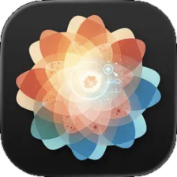
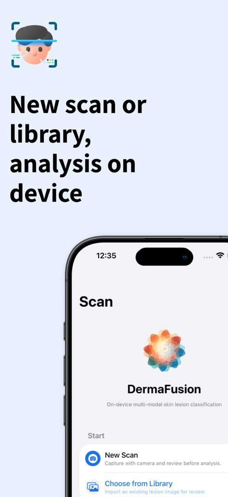
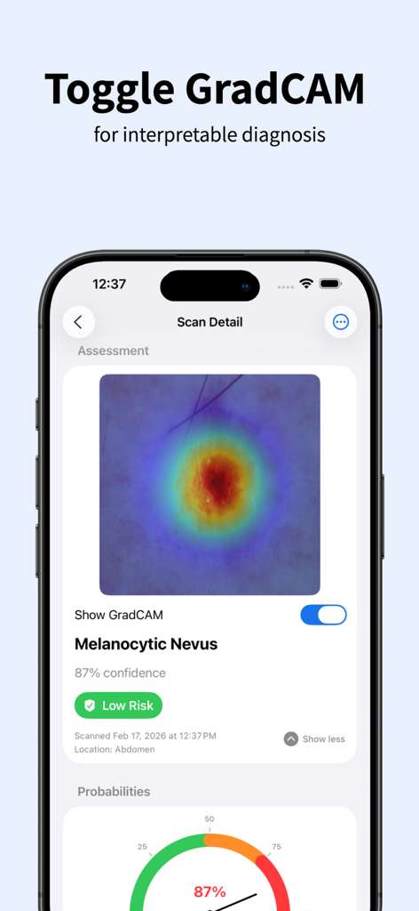

<div align="center">



# DermaFusion

**On-device skin-lesion classification · Research prototype**

A two-model EfficientNet-B4 ensemble trained on four public dermatology datasets, shipped as a Gradio research demo and a native iOS app that analyzes photos entirely on iPhone with no cloud, sign-in, or analytics.

**[Project page ›](https://rahulreddykota.github.io/dermafusion.html)**

| 0.830 | 95.4% | 61,694 |
| :---: | :---: | :---: |
| AUROC | Top-3 accuracy | Training images |

</div>

## DermaFusion screens.

<p align="center">
  
  
  
  
  
</p>

<p align="center"><sub>Screens from the DermaFusion iOS app, which runs the exported ensemble on device. The app's source code is not in this repository.</sub></p>

## Overview

Multi-source deep learning for **8-class skin-lesion classification**, with Grad-CAM heatmap overlays, a malignant-risk gauge, and melanoma triage. The iOS app adds camera capture and photo import, non-skin image rejection, and PDF report export through the share sheet. Designed for educational research, not as a medical device.

## What I built.

1. Two-model EfficientNet-B4 soft-vote ensemble (E0 + E3, 380 × 380) for 8-class skin-lesion classification
2. Trained on 61,694 dermoscopic and smartphone images unified from ISIC 2018/2019/2020 and PAD-UFES-20
3. Patient-grouped splits with zero patient or lesion overlap, Shades-of-Gray color constancy, and DullRazor hair removal
4. Class-balanced focal loss, MixUp, EMA, Dirichlet-tuned ensemble weights, and per-class thresholds
5. Gradio research demo with Grad-CAM overlays, plus Core ML export to two FP16 packages (34 MB each) that run fully on device in the iOS app
6. 0.830 malignant-vs-benign AUROC and 95.4% top-3 accuracy on a 5,279-image held-out test set, verified through automated clinical-readiness gates

## In depth.

Multi-source deep learning for **8-class skin-lesion classification** (MEL, NV, BCC, AKIEC, BKL, DF, VASC, OTHER), trained on four public dermatology datasets and deployed as both a Gradio research demo and a native iOS app.

> [!WARNING]
> **DermaFusion is an educational and research tool. It is not a medical device, not FDA approved, and not a substitute for professional medical advice.** It has not been clinically validated and must not be used to diagnose, screen, or make decisions about any real skin condition. Concerning skin lesions should always be evaluated by a qualified clinician.

### Headline results

Final E0 + E3 soft-vote ensemble (EfficientNet-B4 × 2, 380 × 380), TEST set *n* = 5,279, 1,000-iteration bootstrap 95% CI:

| Metric | Value (95% CI) |
| --- | --- |
| 8-class balanced accuracy | **0.540** [0.509, 0.568] |
| 8-class macro F1 | **0.469** [0.441, 0.495] |
| Top-1 / Top-2 / Top-3 accuracy | 0.778 / 0.907 / 0.954 |
| Binary-malignant AUROC | 0.830 |
| Sensitivity @ 95% specificity | 0.462 |

> **Reading the headline number.** 0.540 balanced accuracy is across **8 unified classes spanning four datasets** (dermoscopic *and* smartphone images), which is a harder setting than a single-dataset 8-class benchmark. Top-2 accuracy of 0.907 and a binary-malignant AUROC of 0.830 are the more clinically meaningful framing of the same model.

### Architecture summary

| Stage | Description |
| --- | --- |
| **Data** | ISIC 2018 / 2019 / 2020 + PAD-UFES-20 → 61,694 dermoscopic + smartphone images, 8 unified classes |
| **Splits** | Patient-grouped (`GroupShuffleSplit` on `patient_id → lesion_id`) + iterative leakage enforcement → TRAIN 52,483 / VAL 3,932 / TEST 5,279, **zero patient/lesion overlap** |
| **Preprocessing** | Shades-of-Gray (power = 6) + DullRazor + 380 × 380 |
| **Backbone** | EfficientNet-B4 (~17.6 M params), two members trained from different starting points |
| **E0** | `efficientnet_b4`, CB-Focal (γ = 1.5) + MixUp + TrivialAugmentWide + EMA 0.999, √-inverse sampler |
| **E3** | `tf_efficientnet_b4.ns_jft_in1k`, class-balanced focal (γ = 2.0), full-inverse sampler |
| **Ensemble** | Soft-vote, Dirichlet-optimised weights `[0.705, 0.295]`, per-class thresholds tuned on VAL macro-F1 |
| **Deployment** | Gradio (single 142 MB ensemble bundle) + iOS (two FP16 `.mlpackage` files, 34 MB each) |

### iOS app: how it works

1. **Capture / import** a close-up of a skin lesion (camera with guided framing, tap-to-focus, macro-lens preference; or photo library).
2. **Preflight**: Vision structural detectors (text / face / animal / barcode) plus a color and quality sanity gate. Non-lesion photos are rejected with actionable guidance before inference.
3. **Inference**: the on-device EfficientNet-B4 soft-vote ensemble (E0 + E3) produces a probability distribution over 8 lesion categories. Everything runs locally via Core ML and the Apple Neural Engine; nothing is uploaded.
4. **Results**: probability chart, malignant-risk gauge, and a Grad-CAM-style attention overlay; optional PDF export; local scan history.

### Privacy

No accounts, no networking code, no analytics, telemetry, ads, or third-party SDKs. Images and results stay on the device.

### Clinical readiness gates

Full-split validation runs against the deployment bundle, and a readiness report turns the results into pass/fail checks. The default `screening_v1` profile checks sample size, top-1 / balanced accuracy / macro-F1, MEL triage sensitivity / specificity / NPV, and class recall for MEL / BCC / AKIEC.

### References

- ISIC 2018 Task 3: [challenge.isic-archive.com/landing/2018](https://challenge.isic-archive.com/landing/2018/)
- ISIC 2019: [challenge.isic-archive.com/landing/2019](https://challenge.isic-archive.com/landing/2019/)
- HAM10000: Tschandl et al., *Scientific Data* (2018)
- PAD-UFES-20: Pacheco et al., *Data in Brief* (2020)
- Shades-of-Gray colour constancy: Finlayson & Trezzi (2004)
- DullRazor hair removal: Lee et al. (1997)
- Class-balanced focal loss: Cui et al., *CVPR* (2019)

## Under the hood.

`Python` `PyTorch` `EfficientNet-B4` `Grad-CAM` `OpenCV` `Gradio` `Core ML`

<sub>Designed for educational research, not as a medical device. Awarded the AI RADA & Healthcare prize, Jan 2026.</sub>

---

## In this repository

This repository holds the **data and evaluation side** of the DermaFusion pipeline: dataset loading, colour constancy and hair removal, leakage-safe splits, a lesion-aware class-balanced sampler, augmentations, and the metrics, calibration, fairness and statistics modules, along with training configs, analysis notebooks and the Gradio demo entry points.

The results above are for the complete system, which is trained by the end-to-end Colab notebook in the [full pipeline repository](https://github.com/ManikantaSirumalla/DermaFusion). That repository also has the per-class breakdown and the ISIC 2019 leaderboard comparison. The code here comes from the project's HAM10000 / ISIC 2018 Task 3 (7-class) stage.

```
DermaFusion-Skin-Cancer/
├── src/
│   ├── data/
│   │   ├── dataset.py        # HAM10000Dataset: image, metadata and label per sample
│   │   ├── preprocessing.py  # Shades-of-Gray, DullRazor, metadata encoding, grouped splits
│   │   ├── sampler.py        # ClassBalancedSampler: class-balanced and lesion-aware
│   │   └── transforms.py     # Train, validation and 8x test-time augmentation transforms
│   └── evaluation/
│       ├── metrics.py        # Balanced accuracy, macro F1, per-class sensitivity and AUROC
│       ├── calibration.py    # Calibration error, reliability diagram, temperature scaling
│       ├── fairness.py       # Demographic parity, equalized odds, per-group accuracy
│       └── statistical.py    # Bootstrap confidence intervals, McNemar test
├── configs/
│   ├── data/ham10000.yaml    # Data paths, 380 px images, split sizes and seed
│   └── training/
│       ├── default.yaml      # AdamW, cosine schedule with warm-up, focal loss
│       └── finetune.yaml     # Short low-learning-rate fine-tuning run
├── notebooks/
│   ├── 01_eda.ipynb                   # EDA for ISIC 2018 Task 3 / HAM10000
│   ├── 02_Baseline.ipynb              # Outline for the image-only baselines
│   ├── 03_training_analysis.ipynb     # Loss and balanced-accuracy curves
│   ├── 04_results_analysis.ipynb      # Ablation comparison and checks of saved outputs
│   ├── 05_Analysis.ipynb              # Outline for the final analysis
│   └── Colab_Train_HairRemoved.ipynb  # Colab GPU training run with hair-removed images
├── demo/
│   └── app.py                # Gradio research demo
├── app/
│   └── gradio_demo.py        # Launcher for the demo
├── COLAB_SETUP.md            # Step-by-step Colab training guide
├── run_train_colab.py        # Colab launcher for scripts/train.py
├── requirements.txt
├── pyproject.toml
├── LICENSE
└── README.md
```

> **Layout note:** the files are currently stored at the top level of this repository, and `requirements (2).txt` is the `requirements.txt` used below. The tree shows the package layout the code expects.

**Not in this repository:** `src/models`, `src/training`, `src/utils`, `src/evaluation/interpretability.py`, `scripts/`, `tests/` and the Core ML export. They are in the [full pipeline repository](https://github.com/ManikantaSirumalla/DermaFusion), which uses the same folder layout. The Gradio demo and the Colab training files need them, and so does importing the `src.evaluation` package, whose `__init__.py` also loads the Grad-CAM helpers.

### Setup

```bash
git clone https://github.com/RahulReddyKota/DermaFusion-Skin-Cancer.git
cd DermaFusion-Skin-Cancer
python -m venv .venv
source .venv/bin/activate          # Windows: .venv\Scripts\activate
pip install -r requirements.txt
```

Requires **Python 3.10 or 3.11** (the pinned scikit-learn has no prebuilt package for 3.12) and **PyTorch 2.1+**.

## License

[MIT](LICENSE).
